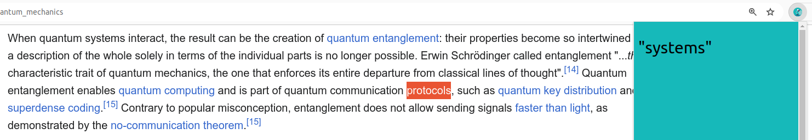

# cleartext2

cleartext2 is a reboot of [ClearText](https://github.com/bencwallace/cleartext). ClearText was a proof-of-concept
demonstrating how one could leverage modern deep learning techniques for NLP, in particular text simplification,
to create a product to help students of English improve their reading comprehension skills. cleartext2 continues
to investigate this idea but focuses on [lexical simplification](https://en.wikipedia.org/wiki/Lexical_simplification)
while making use of newer developments in machine learning, particularly masked/bidirectional LLMs, which are a good
fit for the task.

cleartext2 can be thought of as a "simplification thesauraus": For a word in a given context, it tries to
find a suitable "simple" replacement that makes sense in the same context. This allows students of English
to read a text without having to refer to an English dictionary (which can often make the task of reading
more difficult) or translation dictionaries, which take the student out of the language entirely.

A fairly simple example where this might be useful is the following sentence:

> The *erudite* counsel rose to address the court, his manner *grave* as he began to *broach* the subject of his client's alleged misdeeds.

cleartext2 may help a student of English better understand the three italicized words. In the case of "erudite", cleartext2
doesn't provide much of an advantage over a synonym dictionary, since this word has only one meaning. However, in the case of
"grave" and "broach", cleartext2 incorporates context to disambiguate the word before providing a synonym that the student
may already be familiar with (e.g. "serious" or "raise").

> [!IMPORTANT]
> cleartext2 is currently a simple prototype. There are a multitude of ways to approach this problem and there remain numerous experiments to run in order to identify the best approach to the task cleartext2 takes on.

## Set up

1. Set up the development environment using [Poetry](https://python-poetry.org/docs/#installation):

```
poetry install
```

2. Activate the development environment:

```
poetry shell
```

3. Launch the backend:

```
fastapi dev cleartext2/app.py
```

4. [Install the Chrome extension](chrome/README.md)

## Usage

Simply navigate to a webpage with some difficult text, select a word you don't understand and
click on the cleartext2 extension icon. A popup will appear with a simpler word that can be
used in the given context.

## Example

Taken from [Wikipedia: Quantum mechanics](https://en.wikipedia.org/wiki/Quantum_mechanics):



## Training and Evaluation

For more information, see [Experiments](experiments/README.md).
